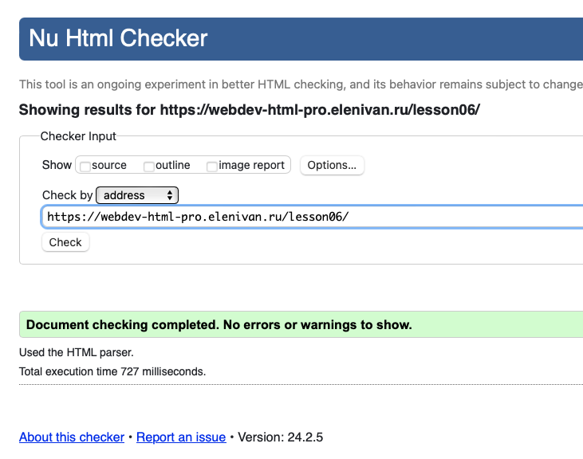
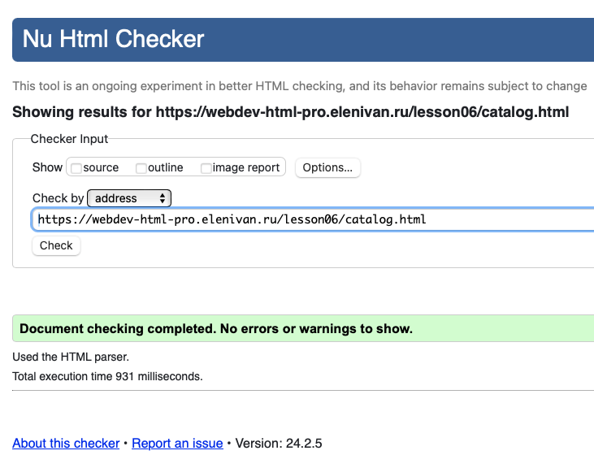
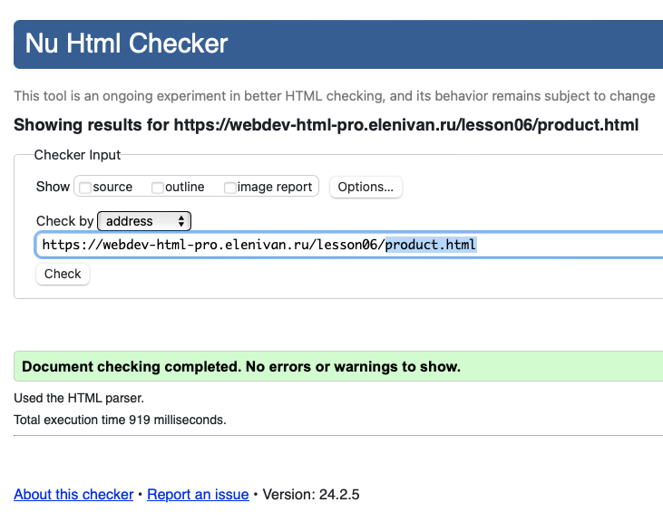
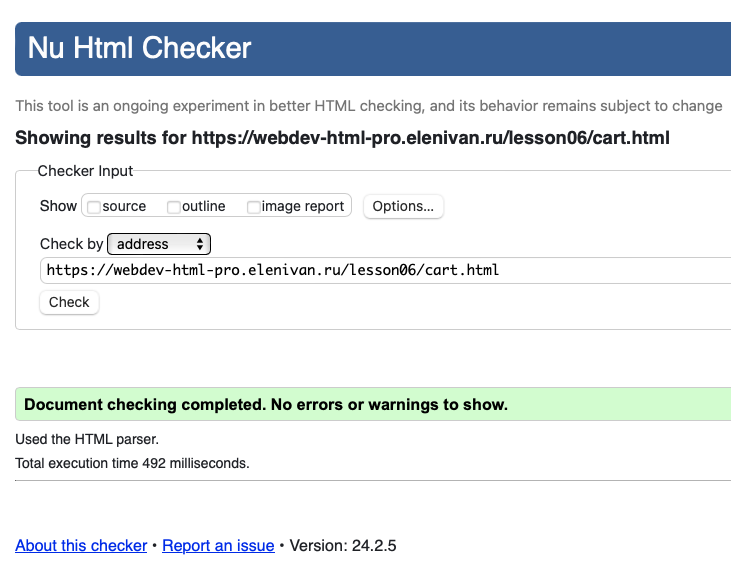
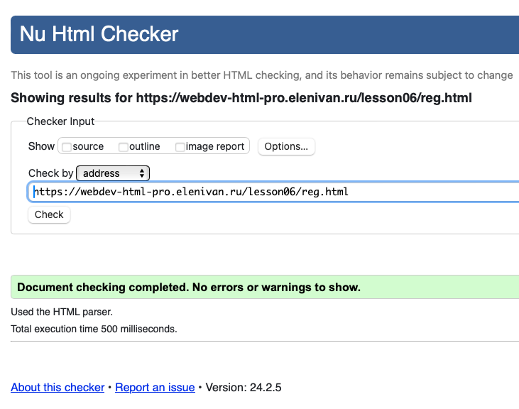

# Урок 6. Продвинутая работа с анимацией, создаем игру на HTML/CSS

## Задание

1. Создать мобильную версию для всех 5 страниц интернет-магазина
2. Проверить работу сайта на разрешении 375px
3. Проверить работу сайта на разрешении 425px
4. Проверить сайта на валидность.

## Решение

Страницы проекта

- Главная - _index.html_
- Каталог - _catalog.html_
- Корзина - _cart.html_
- Регистрация - _reg.html_
- Продукт - _product.html_

Cм. файлы html в корневой директории

Cм. файлы scss в папке [scss](./scss/)

См. готовые страницы проекта на хостинге по ссылке

### Хостинг

https://webdev-html-pro.elenivan.ru/lesson06

### Валидатор

Проверка сайта на валидность проводилась на сервисе
https://validator.w3.org

1. index.html

   

2. catalog.html

   

3. product.html

   

4. cart.html

   

5. reg.html

   
